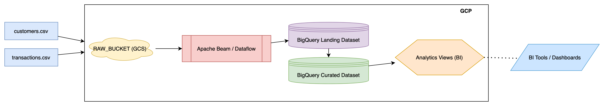

# POC - CSV Data Ingestion Pipeline

This repository contains a **proof-of-concept (POC) ETL pipeline** that ingests customer and transaction CSV data into **BigQuery**, using **Apache Beam (Python)**.  

The pipeline can run:
- Locally with **DirectRunner** (for development and testing).  
- In the cloud with **Google Cloud Dataflow** (for production-like scale).  

Infrastructure (datasets, buckets, IAM, etc.) is provisioned via **Terraform**.  

---

## Architecture Overview



### Flow:
1. CSVs (customers, transactions) → uploaded to a GCS bucket.  
2. Beam pipeline ingests CSVs adding metadata → BigQuery **landing tables**.  
3. SQL templates move/clean & de-dupe → **curated tables**.  
4. BigQuery views expose aggregated metrics for BI/analytics.  

---

## Repository Structure

```
.
├── Makefile                      # All commands entrypoint
├── README.md                     # Project documentation
├── beam                          # Beam pipeline Python code
├── env                           # Environment configs (.env.dev, .env.prod)
├── expected_dummy_data_demo      # Support folder for unit tests
├── local_bucket                  # Dummy csv files for local runs & tests
├── requirements.txt              # Support file for dependencies set up in a virtual environment
├── setup.py                      # Beam packaging for Dataflow
├── sql                           # SQL templates (curate, analytics views)
└── terraform                     # Terraform IaC (with gcp.tfvars)
```

---

## Setup Instructions

### 1. Prerequisites
- **Google Cloud Project** with:  
  - BigQuery  
  - Dataflow  
  - Cloud Storage  
- **Local tools** installed:  
  - Python 3.11  (any other version may break the beam pipeline and the current set up)
  - Terraform  
  - gcloud SDK (`gcloud`, `bq`)  

### 2. Permissions
This POC follows the least-privilege approach. 
Summary of the IAM permissions provisioned by Terraform is displayed in the below table:  

| Who                | Where                        | Role                        | Why                                                                 |
|--------------------| ---------------------------- | --------------------------- | ------------------------------------------------------------------- |
| Dataflow Worker SA | Project                      | `roles/dataflow.worker`     | Allows the service account to run Dataflow jobs & workers.           |
| Dataflow Worker SA | Project                      | `roles/bigquery.jobUser`    | Allows submitting/querying BigQuery jobs (needed for loads).         |
| Dataflow Worker SA | RAW bucket                   | `roles/storage.objectViewer` | Grants read-only access to objects (read CSVs from RAW).             |
| Dataflow Worker SA | Landing dataset              | `roles/bigquery.dataEditor` | Read/write within landing dataset (insert Dataflow output).          |
| Dataflow Worker SA | Curated dataset              | `roles/bigquery.dataEditor` | Read/write curated dataset (if Dataflow also writes curated tables). |
| Dataflow Worker SA | Dataflow staging bucket      | `roles/storage.objectAdmin` | Full object-level access on Dataflow staging/temp bucket.            |

For this POC, no developer or analyst additional permissions have been taken into consideration. In a corporate production environment additional permissions would be required. 

### 3. Environment Files
Runtime configuration lives in the `env/` folder:  
- `env/.env.dev` → used for local runs with DirectRunner.  
- `env/.env.prod` → used for Dataflow runs.  

Terraform uses a single shared vars file (could be split in further if different endpoints are used for the develop and test phase but it was not necessary in this prototype):  
- `terraform/gcp.tfvars`

### 4. Infrastructure (Terraform)

Provision required GCS buckets, datasets, tables, IAM, etc:  

```bash
make terraform-init
make terraform-plan
make terraform-apply
```

Destroy infra if needed:  

```bash
make terraform-destroy
```

### 5. Python Environment

```bash
make install
```

This checks if you have Python 3.11 installed in your local machine and 
1. if you do not have it, it prints a message with the required command to install it (have on purpose not included the installation step).
2. if you have, it creates a local venv (`py3/`) and installs:  
- Apache Beam for GCP  
- pytest  
- python-dotenv  
- the local `beam/` package  

### 6. Run the Pipeline

**Local (DirectRunner):**

```bash
make run-local ENV=dev
```

**Cloud (Dataflow):**

```bash
make run-dataflow ENV=prod
```

### 7. Curated Tables

Run SQL transformations to move/clean data into curated tables:

```bash
make curate-customers
make curate-transactions
```

### 8. Analytics Views

Create dataset and BI views:  

```bash
make create-analytics
make view-monthly
make view-avg-monthly
make view-ltv
make view-top5
```

### 9. Clean Up
Delete analytics dataset:  

```bash
make delete-analytics
```

Remove the virtual environment from your local machine:  

```bash
make clean  
```

Destroy the GCP infrastructure:  

```bash
make terraform-destroy  
```

---

## Assumptions
- Developer runs this pipeline on a MAC laptop.
- **Single Terraform vars file** (`gcp.tfvars`) is sufficient for this POC; env split will be future work.  
- **.env.dev** and **.env.prod** contain all Beam/Dataflow required runtime configs.  
- Landing tables are append-only; deduplication happens in curated tables.  
- CSV schemas (customers, transactions) are stable and are dropped into a bucket by a stakeholder, 3d party company or another process such as an MFT job.  
- Pipeline assumes a single GCP project (can be generalized later).  
- To demonstrate transformations can occur in a beam job, minor transformations have been implemented in this POC but the heavy lifting can occur after loading the data into the landing dataset as strings.
- A simple CI job (github workflow action) has been added that runs a unit test when a git push occurs and when a PR is created.
- This POC is used to demonstrate technical skills, it has not been productionised on purpose.

---

## Future Improvements
- **Proper environments:** Separate `dev`, `test`, `prod` configs for Terraform.  
- **CI/CD:** More complicated unit tests can be added and restrictions can be put in place, such as a merge block till the github action has succeeded. 
- **CI/CD:** Implement remote state backends for Terraform, integrate terraform plan and apply into GitHub Actions pipelines with policy-as-code enforcement (tailored to each environment). 
- **Productionise** the pipeline (i.e.1 auto-trigger on file arrival; GCS → Pub/Sub → Dataflow → Call BigQuery API to kick off SQL scripts, i.e.2 Use Airflow/Composer to ingest the files and trigger all required DAGs - a sensor operator would be required in the GCS bucket). 
- **Monitoring:** Dataflow job metrics in Cloud Monitoring + alerting.  
- **Secrets management:** Secret Manager or Vault can be used for any sensitive infrastructure related value.  
- **Testing:** Add more complicated e2e validation comparing CSV input vs BigQuery output. Add load testing capability.
- **File clean up:** Files could be archived in another bucket once ingested for safe keeping and regulatory reasons.
- **Cost optimisation:** Files could be compressed after ingestion, lifecycle rules could be enforced, cap the workers number when running dataflow jobs, choose worker machine type.
- **Data Protection/Governance:** Incorporate controls for handling PII by enforcing data classification labels at the IaC level, ensuring that resources storing PII are encrypted and accessible only by the required stakeholders.

---

## Quick Reference (Makefile)

```bash
make install                 # create venv + install deps
make test                    # run pytest
make terraform-init          # init terraform
make terraform-plan          # terraform plan (gcp.tfvars)
make terraform-apply         # terraform apply
make terraform-destroy       # terraform destroy
make print-vars ENV=dev      # see/debug resolved vars
make run-local ENV=dev       # run pipeline locally
make run-dataflow ENV=prod   # run pipeline on Dataflow
make curate-customers        # curate customers
make curate-transactions     # curate transactions
make create-analytics        # create analytics dataset
make delete-analytics        # delete analytics dataset
make view-monthly            # BI views - create/replace customer_monthly_spend view
make view-avg-monthly        # BI views - create/replace avg_monthly_totals view
make view-ltv                # BI views - create/replace customer_ltv view
make view-top5               # BI views - create/replace top_5pct_customers view
make truncate-local          # truncate landing tables
make clean                   # remove venv/tmp
```
